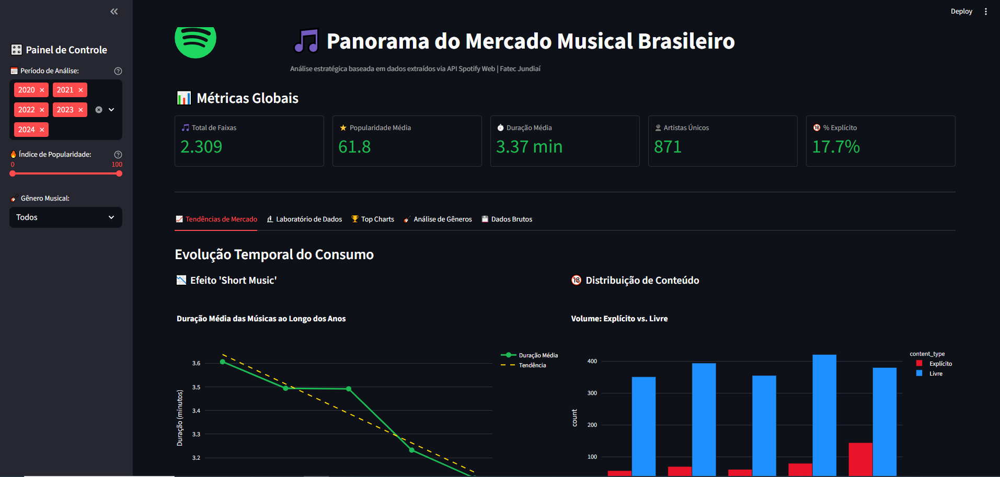
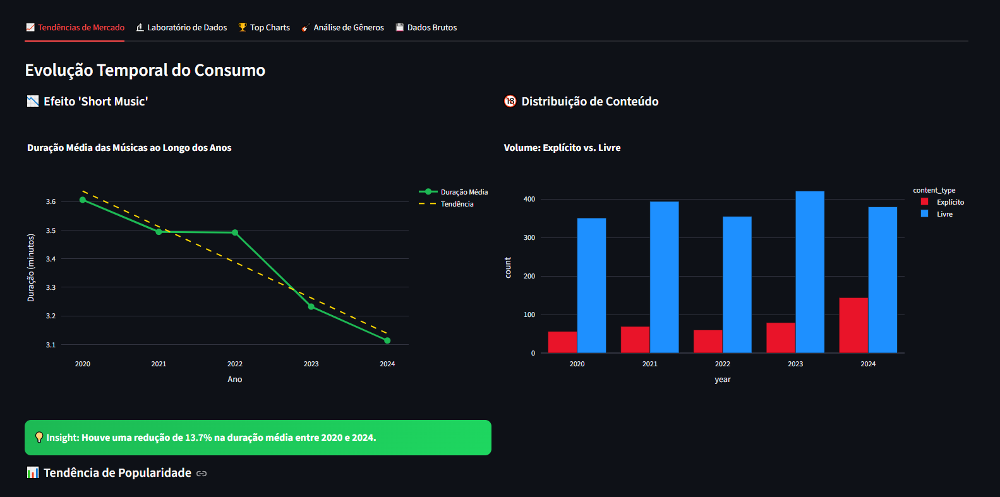
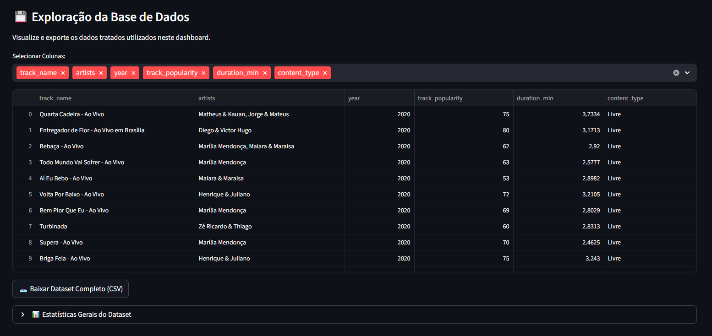

Markdown

# 🎵 Panorama do Mercado Musical Brasileiro (2020-2024)


## 📌 Sobre o Projeto

Este projeto foi desenvolvido como Trabalho de Conclusão da disciplina de **Estrutura de Dados e Big Data** da **Fatec Jundiaí**.

O objetivo foi criar uma solução completa de Ciência de Dados (End-to-End) que coleta, processa e visualiza dados reais do Spotify para analisar a evolução do mercado musical brasileiro nos últimos 5 anos. O dashboard responde a perguntas estratégicas sobre o comportamento de consumo, como a redução da duração das músicas ("Efeito TikTok") e a predominância de gêneros nacionais.

---

## 👥 Integrantes do Grupo

* **[Breno Brocanello]**
* **[Karina Mileo]**
* **[Ivan Negri]**
* **[Gabrielle Carvalho]**
* **[Heloíza Cristina ]**
* **[João Victor ]**

---

## 🛠️ Arquitetura e Tecnologias

O projeto foi dividido em duas camadas principais para garantir performance e segurança (evitando falhas de API durante a apresentação):

1.  **Backend (Coleta & ETL):**
    * Script: `API_spotify_tracks_V2.py`
    * Responsável por conectar na API do Spotify, buscar playlists oficiais e fazer varredura profunda por gêneros.
    * Realiza a limpeza, tratamento de nulos e salva os dados processados em arquivos locais (`.csv`).
2.  **Frontend (Dashboard):**
    * Script: `app.py`
    * Interface interativa construída com **Streamlit**.
    * Lê os dados estáticos processados, garantindo alta velocidade de carregamento e zero dependência de internet na hora da análise.

**Stack Tecnológica:**
* **Linguagem:** Python
* **Bibliotecas:** Pandas (Manipulação de dados), Plotly (Gráficos interativos), Requests (Consumo de API), Streamlit (Interface Web).

---

## 🔎 Perguntas-Chave Respondidas

O dashboard foi desenhado para responder a 4 perguntas de negócio principais:

1.  **Tendência Temporal:** As músicas estão ficando mais curtas ao longo dos anos devido à influência das redes sociais?
2.  **Conteúdo:** Houve aumento no volume de músicas com conteúdo explícito no topo das paradas?
3.  **Correlação:** Existe uma relação direta entre a duração de uma música e sua popularidade? Músicas longas têm menos chance de virar "Hit"?
4.  **Ecossistema:** Quais são os gêneros dominantes no Brasil além do Sertanejo?

---

## 📸 Screenshots do Projeto

### 1. Visão Geral e KPIs
*Painel principal com métricas globais e filtros interativos de ano e popularidade.*


### 2. Análise de Tendências
*Gráficos que comprovam a queda na duração média das músicas entre 2020 e 2024.*


### 3. Exploração de Dados
*Tabela interativa com os dados brutos enriquecidos (Gênero, Seguidores, Popularidade).*


---

## 🚀 Como Rodar o Projeto Localmente

Siga os passos abaixo para executar a aplicação na sua máquina.

### Pré-requisitos
* Python 3 instalado.
* Conta no Spotify Developers (para obter Client ID e Secret, caso queira atualizar os dados).

### Passo 1: Clone o repositório
```bash
git clone https://github.com/ivanegri/proj_est_dados.git
cd NOME_DO_REPO
Passo 2: Crie um ambiente virtual (Recomendado)
Bash

# Windows
python -m venv venv
.\venv\Scripts\activate

# Linux/Mac
python3 -m venv venv
source venv/bin/activate
Passo 3: Instale as dependências
Bash

pip install -r requirements.txt
Passo 4: Configuração de Ambiente (.env)
Crie um arquivo .env na raiz do projeto e adicione suas credenciais do Spotify (necessário apenas se for rodar o script de coleta):

Ini, TOML

SPOTIFY_CLIENT_ID=sua_chave_aqui
SPOTIFY_CLIENT_SECRET=seu_segredo_aqui
Passo 5: Executar o Dashboard
Os dados de 2020 a 2024 já estão processados na pasta raw_data. Para visualizar:

Bash

streamlit run app.py
(Opcional) Para coletar novos dados:

Bash

python API_spotify_tracks_V2.py --years 2024 --outfile-prefix dados_brasil --max-tracks 500
📂 Estrutura de Arquivos
/projeto
│
├── app.py                     # Aplicação Frontend (Streamlit)
├── API_spotify_tracks_V2.py   # Script de Coleta e ETL (Backend)
├── requirements.txt           # Dependências do projeto
├── .gitignore                 # Arquivos ignorados (segurança)
├── README.md                  # Documentação
│
└── raw_data/                  # Base de dados processada (CSVs)
    ├── dados_brasil_2020.csv
    ├── dados_brasil_2021.csv
    └── ...
Nota: Este projeto utiliza dados públicos da API do Spotify e foi desenvolvido estritamente para fins acadêmicos.
